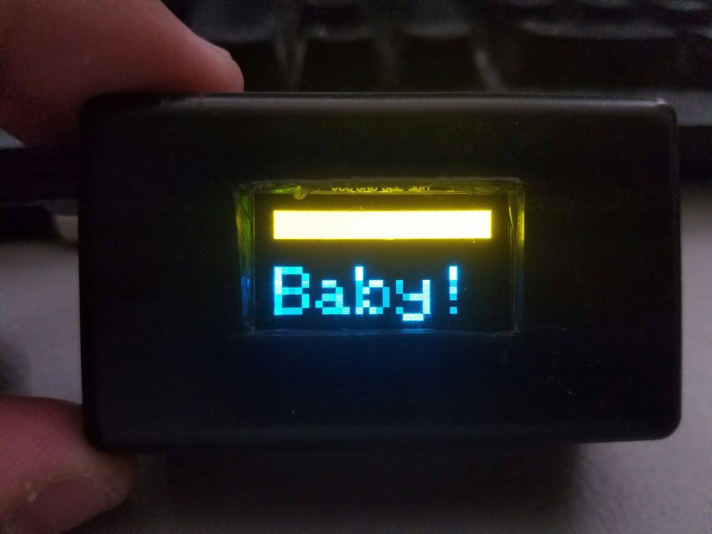
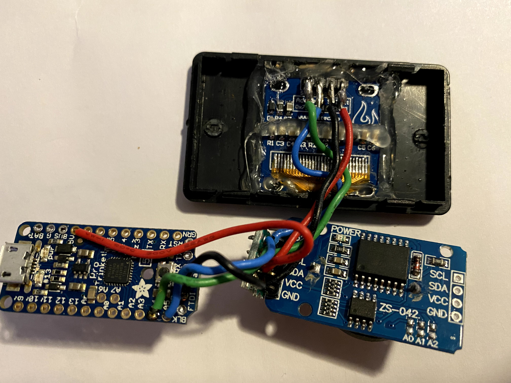

# arduino-pregnancy-clock
A fun display to count the days until a baby's due date

## Description

For one of my kids, we announced my wife's pregnancy by creating a tiny little count up clock.

The board was an Arduino Nano connected to a real-time clock module and a SSD1306-based OLED display (the bar accross the top was yellow, and the remainder of the display was blue).  The whole thing was wired as closely as possible and jammed into a tiny project box which was almost _exactly_ the right size to hold it all.

We gave the tiny little clock to my parents for Christmas, it took a while for them to figure out what it was... and what it meant... but that was all part of the fun.

